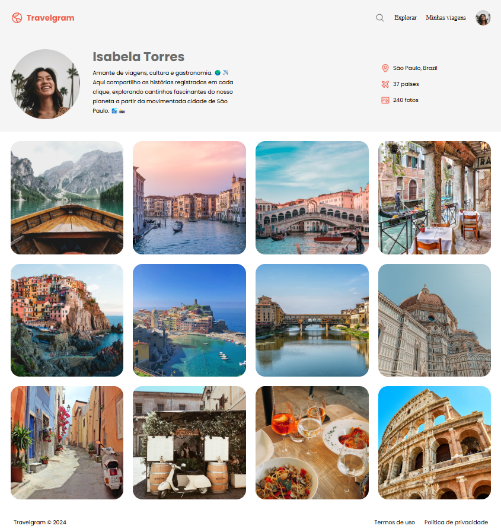

<h1 align="center">Travelgram</h1>

Perfil de viagens

 

# 💻 Projeto

Esse é um projeto desenvolvido em aula na formação Full-stack, Rocketseat.

 

  
  

 

# 🚀 Tecnologias

Esse projeto foi desenvolvido com as seguintes tecnologias:

- HTML e CSS
- Git e Github
- Figma

 

# 🔖 Layout

Você pode visualizar o layout do projeto através [DESSE LINK](https://www.figma.com/design/rkRzcMCHKCx7mceDGXYGrK/Perfil-de-viagens-(Community)?node-id=0-1&node-type=canvas&t=dFK5E3xdAl24Bv3D-0). É necessário ter conta no [Figma](https://figma.com) para acessá-lo.
